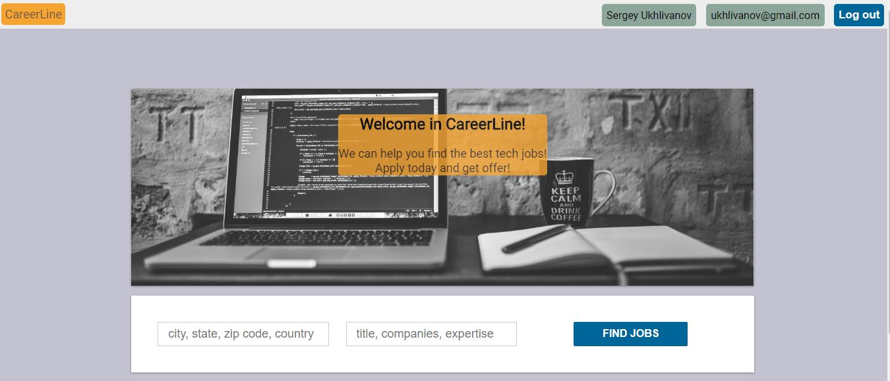
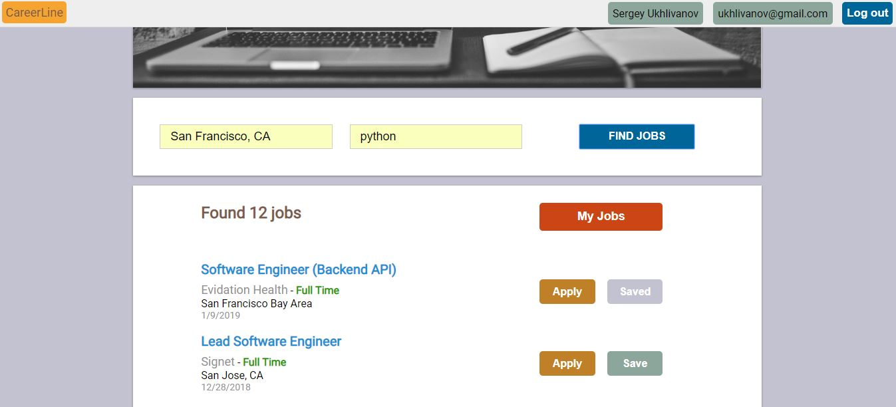
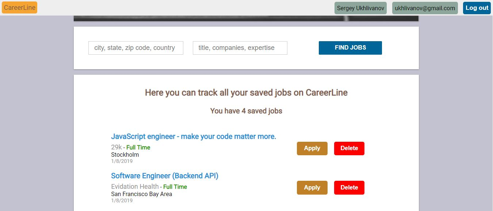

# Project Title

Tech Job Search Appliction (https://sheltered-oasis-79421.herokuapp.com/)

# Motivation

Career Line is an app that helps to search for a tech job. App offers the most current and latest jobs. Just a couple of times with a mouse click, you will receive a list of current and high-quality jobs in the USA. 

## Screenshots

Welcome screen:

Log in screen:

New user registration screen:

Main screen with search form:

Screen with found jobs:

Screen with saved jobs:

## Built With

* [HTML]
* [CSS]
* [JavaScript]
* [React.js]
* [Node.js]
* [MongoDB]
* [Mongoose]

## Contributing

Node.js documentation
https://nodejs.org/en/docs/

MongoDB manual
https://docs.mongodb.com/manual/

React.js guide
https://reactjs.org/

The GitHub Jobs API documentation (https://jobs.github.com/api)

## Authors

* **Sergey Ukhlivanov** - [ukhlivanov](https://github.com/ukhlivanov/)

## Acknowledgments

* GitHub API
* React.js
* Redux
* Node.js
* Express
* MongoDB
* Inspiration
